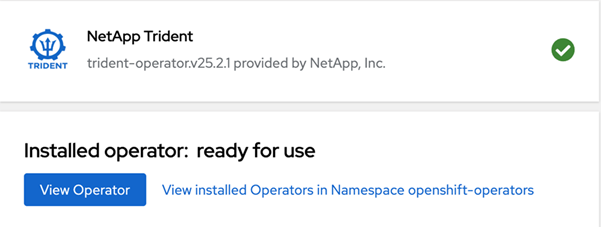

= OpenShift OperatorHub를 사용하여 Trident 설치
:hardbreaks:
:allow-uri-read: 
:icons: font
:imagesdir: ../media/

[role="lead"]
Red Hat OpenShift를 사용하는 경우 Red Hat 인증 운영자를 사용하여 NetApp Trident를 설치할 수 있습니다. Red Hat OpenShift Container Platform에서 Trident를 설치하려면 다음 절차를 따르십시오.

.시작하기 전에
설치를 시작하기 전에 link:../trident-get-started/requirements.html["Trident 설치를 위한 환경을 준비하세요"].

== Trident 운영자를 찾아서 설치하십시오

.단계
. OpenShift OperatorHub로 이동하여 NetApp Trident를 검색합니다.
+
image::../media/openshift-operator-01.png[Trident Operator]

. *NetApp Trident*를 클릭하여 설치 설정을 엽니다.
. 필요한 옵션을 선택하고 *Install*을 클릭하여 Operator 구성을 엽니다.
+
image::../media/openshift-operator-02.png[설치]

+

NOTE: 최신 Operator 버전을 선택했는지 확인하십시오.

. 모든 매개변수를 그대로 유지하고 *Install*을 클릭하십시오.
+
image::../media/openshift-operator-03.png[설치]

+
설치가 완료되면 Operator가 설치된 Operator 목록에 표시되며 바로 사용할 수 있습니다.

. *운영자 보기*를 클릭하여 운영자의 세부 정보를 확인합니다.
+

. *Trident Orchestrator*에서 *인스턴스 생성*을 클릭합니다.
+
image::../media/openshift-operator-07.png[설치됨]

. *YAML 보기*를 클릭하고 다음 내용을 양식에 붙여넣으세요.
+
[source, yaml]
----
apiVersion: trident.netapp.io/v1
kind: TridentOrchestrator
metadata:
  name: trident
  namespace: openshift-operators
spec:
  IPv6: false
  debug: false
  nodePrep:
  - iscsi
  imageRegistry: ''
  k8sTimeout: 30
  namespace: trident
  silenceAutosupport: false
----
+
[]
====
** Red Hat Enterprise Linux CoreOS(RHCOS)에는 iSCSI가 활성화 및 구성되어 있지 않습니다.
**  `nodePrep` 매개변수를 추가하면 모든 OpenShift 워커 노드에서 iSCSI 및 멀티패스 서비스를 구성하고 활성화할 수 있습니다.
** OpenShift 4.19부터 이 기능을 지원하는 최소 Trident 버전은 25.06.1입니다.

====
. *생성*을 클릭하면 Trident Orchestrator가 완전히 설치됩니다.
+
image::../media/openshift-operator-08.png[설치됨]

== Trident 운영자를 제거합니다

.단계
. 설치된 Operator 목록에서 Trident Operator를 선택합니다.
. 연산자에서 모든 피연산자 인스턴스를 삭제할지 여부를 선택하십시오.
+

WARNING: *이 연산자의 모든 피연산자 인스턴스 삭제* 확인란을 선택하지 않으면 Trident가 제거되지 않습니다.

. *제거*를 클릭합니다.

