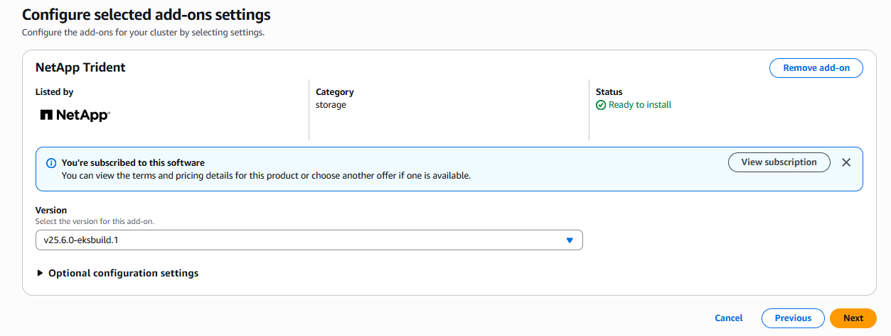
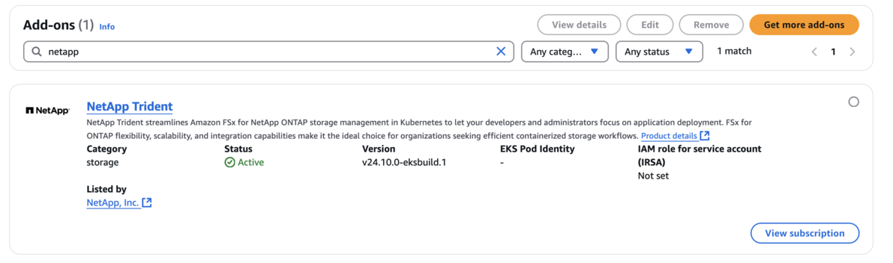

= EKS 클러스터에 Trident EKS 애드온을 구성합니다
:hardbreaks:
:allow-uri-read: 
:icons: font
:imagesdir: ../media/

[role="lead"]
NetApp Trident는 Kubernetes 환경에서 Amazon FSx for NetApp ONTAP 스토리지 관리를 간소화하여 개발자와 관리자가 애플리케이션 배포에 집중할 수 있도록 지원합니다. NetApp Trident EKS 애드온에는 최신 보안 패치와 버그 수정 사항이 포함되어 있으며, AWS에서 Amazon EKS와의 호환성을 검증받았습니다. 이 EKS 애드온을 사용하면 Amazon EKS 클러스터의 보안과 안정성을 지속적으로 유지할 수 있으며, 애드온 설치, 구성 및 업데이트에 필요한 작업량을 줄일 수 있습니다.

== 필수 구성 요소

AWS EKS용 Trident 애드온을 구성하기 전에 다음 사항을 확인하십시오.

* 추가 기능을 사용할 수 있는 권한이 있는 Amazon EKS 클러스터 계정입니다. link:https://docs.aws.amazon.com/eks/latest/userguide/eks-add-ons.html["Amazon EKS 추가 기능"^]을(를) 참조하십시오.
* AWS Marketplace에 대한 AWS 권한:
`"aws-marketplace:ViewSubscriptions",
"aws-marketplace:Subscribe",
"aws-marketplace:Unsubscribe`
* AMI 유형: Amazon Linux 2(AL2_x86_64) 또는 Amazon Linux 2 Arm(AL2_ARM_64)
* 노드 유형: AMD 또는 ARM
* 기존 Amazon FSx for NetApp ONTAP 파일 시스템

== 단계

. EKS Pod가 AWS 리소스에 액세스할 수 있도록 IAM 역할과 AWS 시크릿을 생성해야 합니다. 자세한 지침은 link:../trident-use/trident-fsx-iam-role.html["IAM 역할 및 AWS Secret을 생성합니다"^]를 참조하십시오.
. EKS Kubernetes 클러스터에서 *Add-ons* 탭으로 이동합니다.
+
image::../media/aws-eks-01.png[aws eks 01]

. *AWS Marketplace add-ons*로 이동하여 _storage_ 카테고리를 선택하세요.
+
image::../media/aws-eks-02.png[aws eks 02]

. *NetApp Trident*를 찾아 Trident 추가 기능 확인란을 선택한 다음 *다음*을 클릭합니다.
. 원하는 추가 기능 버전을 선택합니다.
+

. 필요한 추가 기능 설정을 구성하십시오.
+
image::../media/aws-eks-04.png[aws eks 04]

. IRSA(서비스 계정용 IAM 역할)를 사용하는 경우 추가 구성 단계link:https://docs.netapp.com/us-en/trident/trident-use/trident-fsx-install-trident.html#enable-the-trident-add-on-for-aws["여기"]를 참조하십시오.
. *생성*을 선택합니다.
. 추가 기능의 상태가 _Active_인지 확인하십시오.
+

. 다음 명령을 실행하여 Trident가 클러스터에 제대로 설치되었는지 확인하십시오.
+
[listing]
----
kubectl get pods -n trident
----
. 설정을 계속 진행하여 스토리지 백엔드를 구성하십시오. 자세한 내용은 link:../trident-use/trident-fsx-storage-backend.html["스토리지 백엔드 구성"^]를 참조하십시오.

== CLI를 사용하여 Trident EKS 애드온 설치/제거

.CLI를 사용하여 NetApp Trident EKS 추가 기능을 설치합니다.
다음 예시 명령어는 Trident EKS 애드온을 설치합니다.
`eksctl create addon --cluster clusterName --name netapp_trident-operator --version v25.6.0-eksbuild.1`(전용 버전 포함)

다음 예시 명령은 Trident EKS 애드온 버전 25.6.1를 설치합니다:
`eksctl create addon --cluster clusterName --name netapp_trident-operator --version v25.6.1-eksbuild.1` (전용 버전 포함)

다음 예시 명령은 Trident EKS 애드온 버전 25.6.2를 설치합니다:
`eksctl create addon --cluster clusterName --name netapp_trident-operator --version v25.6.2-eksbuild.1` (전용 버전 포함)

.CLI를 사용하여 NetApp Trident EKS 추가 기능을 제거합니다.
다음 명령을 실행하면 Trident EKS 추가 기능이 제거됩니다.

[listing]
----
eksctl delete addon --cluster K8s-arm --name netapp_trident-operator
----